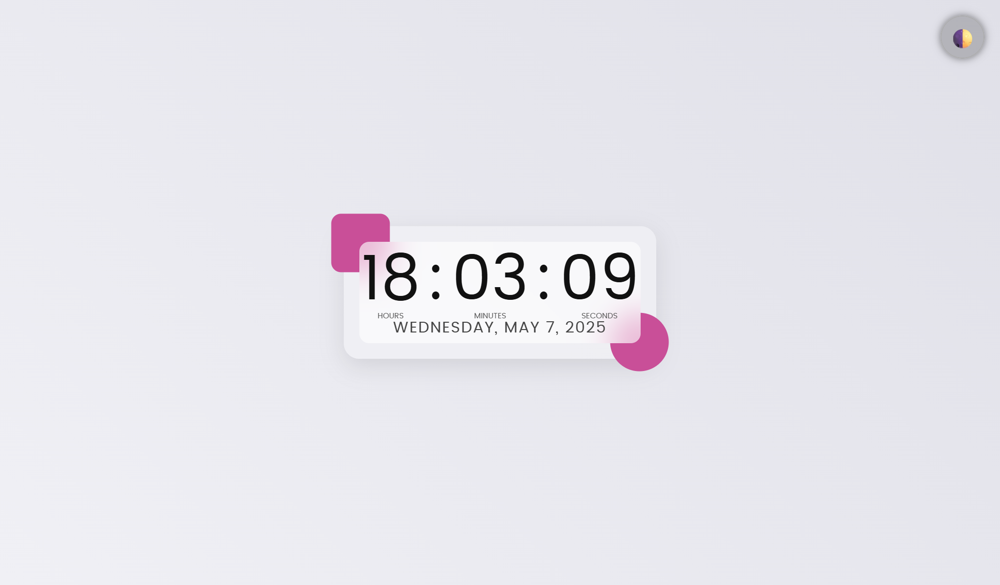
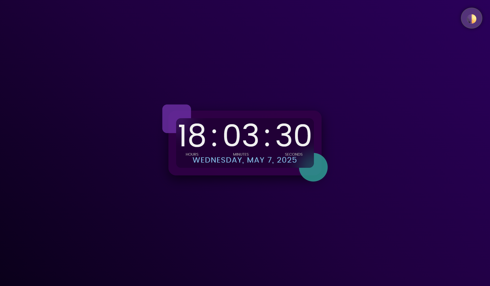

<!-- Badges -->

[](https://developer.mozilla.org/en-US/docs/Web/Guide/HTML/HTML5)
[](https://developer.mozilla.org/en-US/docs/Web/CSS)
[](https://developer.mozilla.org/en-US/docs/Web/JavaScript)
[](./LICENSE)


---

# Modern Clock

*A responsive, theme-toggleable digital clock with animated backgrounds and fluid typography.*

**🔗 [Live Demo](https://madashivakarthikgoud.github.io/clock)**

---

## 🎨 Screenshot

<!-- Replace with actual screenshots in docs/screenshots/ -->

| Light Theme                               |
| ---------------------------------- |
|  |

| Dark Theme                               |
| ---------------------------------- |
|  |

---

## 🚀 Key Features

* **Real-Time Display:** Updates every second to show HH\:MM\:SS and localized full date.
* **Light & Dark Modes:** Toggle between themes; preference saved in `localStorage`.
* **Animated Gradient:** Smooth, infinite background pulse using CSS keyframes.
* **Frosted Glass UI:** Glassmorphic container with hover scale and decorative accents.
* **Fluid Typography:** Scales text with viewport width; automatic labels via CSS pseudo-elements.

---

## 📂 Project Structure

```plaintext
clock/
├── index.html       # Main HTML markup
├── styles.css       # Reset, theming, animations, layout
└── script.js        # Time update and theme toggle logic
```

---

## 💻 Getting Started

1. **Clone the repository**

   ```bash
   git clone https://github.com/madashivakarthikgoud/clock.git
   cd clock
   ```

2. **Open `index.html` in your browser**

   * Double-click the file
   * Or serve with a simple HTTP server:

     ```bash
     npx serve .
     ```

3. **Interact**

   * Watch live time & date
   * Click the 🌓 button to switch themes

---

## 🤝 Contributing & Support

Love it? Show some ❤️:

* ⭐️ **Star** the repo to support the project!
* 🍴 **Fork** and build your own themes or features.
* 🔀 **Submit** a Pull Request—bug fixes, performance tweaks, or new styles are all welcome.

Let's make this clock even more timeless together!

---

## 📜 License

Distributed under the MIT License. See [LICENSE](LICENSE) for details.

---

> Crafted by **Shiva Karthik**
